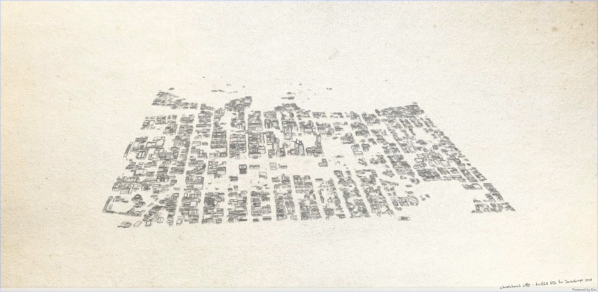

# My Content:

# Christchurch sketch

## Please note my ESRI API key has expired and need to revalidate it.

**View the live app**: [Christchurch sketch **EXPIRED**](./christchurch-cbd/)

# Original content from 

# San Francisco sketch RalucaNicola

**View the live app**: [San Francisco sketch](./sanfranart/)

# Berlin Palace

**View the live app**: [Berlin Palace](./berlin-palace/)

Data provided by [Berlin's Senatsverwaltung für Stadtentwicklung und Wohnen ](https://www.stadtentwicklung.berlin.de/planen/stadtmodelle/de/digitale_innenstadt/3d/download/index.shtml) and processed in CityEngine by [Stefan Arisona](https://robotized.arisona.ch) in [this project](https://github.com/arisona/berlin_3d). [Link to the license for using the data](http://www.stadtentwicklung.berlin.de/geoinformation/download/nutzIII.pdf)

# Earthquakes

**View the live app**: [Earthquakes](./earthquakes/)

Data from [USGS](https://earthquake.usgs.gov/earthquakes/search/).

# WebScene Photobooth

**View the live app**: [WebScene Photobooth](./webscene-photobooth/)

Add your own webscene in the webscene url parameters [https://ralucanicola.github.io/JSAPI_demos/webscene-photobooth/index.html?webscene=0614ea1f9dd043e9ba157b9c20d3c538](https://ralucanicola.github.io/JSAPI_demos/webscene-photobooth/index.html?webscene=0614ea1f9dd043e9ba157b9c20d3c538).

This app uses the screenshot API to take a screenshot of a webscene and apply some filters on it. The filters were created by Joel Besada in the [JSManipulate](http://joelb.me/jsmanipulate/) library. The icons are from [FontAwesome](https://fontawesome.com/icons/).

# Largest cities in the world

**View the live app**:

[Largest cities in 3D - local scene](./urban-population-3d/index.html?mode=local)

[Largest cities in 3D - global scene](./urban-population-3d/index.html)

This app came about by playing around with 3D symbols on a map for Noah's [blog post on visualizing MapImageLayers in 3D](https://www.esri.com/arcgis-blog/products/js-api-arcgis/3d-gis/now-showing-in-3d-mapimagelayer/).

# World population

**View the live app**: [World population](./world-population/)

**Original Data**:

Gridded Population of the World, Version 4 (GPWv4) Population Count, Revision 10 consists of estimates of human population (number of persons per pixel), consistent with national censuses and population registers. The data files were produced as global rasters at 30 arc-second (~1 km at the equator) resolution. This dataset was aggregated to a resolution of ~110km at the equator. The resulting raster was converted to a point dataset. Read more about the data on [SEDAC website](http://sedac.ciesin.columbia.edu/data/set/gpw-v4-population-count-rev10).

[Raw data](http://sedac.ciesin.columbia.edu/data/set/gpw-v4-population-count-rev10/data-download)

# World population in 2020

**View the live app**: [World population in 2020](./world-population-2020/)

**Original Data**:

Gridded Population of the World, Version 4 (GPWv4) Population Count, Revision 10 consists of estimates of human population (number of persons per pixel), consistent with national censuses and population registers. The data files were produced as global rasters at 30 arc-second (~1 km at the equator) resolution. This dataset was aggregated to a resolution of ~110km at the equator. The resulting raster was converted to a point dataset. Read more about the data on [SEDAC website](http://sedac.ciesin.columbia.edu/data/set/gpw-v4-population-count-rev10).

[Raw data](http://sedac.ciesin.columbia.edu/data/set/gpw-v4-population-count-rev10/data-download)

# World globe by Giovanni Cassini

**View the live app**: [World globe by Giovanni Cassini](./cassini-globe/)

**Original Data:**
World Globe scanned, georeferenced and published by [David Rumsey Map Collection](https://www.davidrumsey.com/blog/2009/9/7/cassini-terrestrial-and-celestial-globes-1790)

My contribution was minimal in this app, I only display the published layer using [ArcGIS API for JavaScript](https://developers.arcgis.com/javascript/). Read more about how the map was brought into digital form [here](https://www.davidrumsey.com/blog/2009/9/7/cassini-terrestrial-and-celestial-globes-1790).

# World's biggest cities

**View the live app**: [World's biggest cities](./cities-globe/)

**View a tutorial on how to built this app**: [Tutorial](https://github.com/RalucaNicola/JSAPI_demos/tree/master/cities-globe#worlds-biggest-cities---a-how-to-guide)

**Technologies used**:

- SceneViewer for creating the inital webscene
- ArcGIS API for JavaScript for creating the app

**Original Data**:
Cities and countries feature layers from the [Living Atlas](https://livingatlas.arcgis.com/en/).

# Urban sketch

**View the live app**: [Urban development](./urban-sketch/)

**Technologies used**:

- CityEngine for creating and publishing the data
- SceneViewer for creating the inital webscene
- ArcGIS API for JavaScript for creating the app

**Data**:
Original data created and published by Nik Davis and Devin Lavigne. © Houseal Lavigne Associates, LLC.

# Urban development in Boston

Orange buildings represent urban projects in development

**View the live app**: [Urban development](./urban-development/)

**Technologies used**:

- ArcGIS Pro & CityEngine for publishing the data
- SceneViewer for creating the webscene
- ArcGIS API for JavaScript for creating the app

**Original data**:

- [Boston Planning and Development Agency (BPDA) 3D building models](http://www.bostonplans.org/3d-data-maps/3d-smart-model/3d-data-download)

# San Francisco public transport transit time

**View the live app**: [San Francisco public transport transit time](./public-transport-transit/)

**Technologies used**:

- ArcGIS Pro for processing and publishing the data
- ArcGIS API for JavaScript for creating the app

# Malta in contour lines

Displaying Malta's elevation only using contour lines.

**View the live app**: [Malta in contour lines](./malta-contour-lines/)

**Technologies used**:

- ArcGIS Pro for publishing the contour lines
- ArcGIS API for JavaScript for data visualization

**Data**:

- contour lines from [OpenDEM](http://www.opendem.info/download_contours.html).

# A Holistic Approach to Building 3D Web Apps session demo (DevSummit 2018)

**View the live app**: [Indicity](./indicity/)

**Technologies used**:

- ArcGIS Pro for publishing the data
- SceneViewer for creating the webscene
- ArcGIS API for JavaScript for creating the app

**Original data**:

- [NYC Open Data - Art Galleries](https://data.cityofnewyork.us/Recreation/New-York-City-Art-Galleries/tgyc-r5jh/data) provided by [DoITT](http://www1.nyc.gov/site/doitt/index.page)
- [NYC building data](http://www1.nyc.gov/site/doitt/initiatives/3d-building.page) provided by [DoITT](http://www1.nyc.gov/site/doitt/index.page)

# Scene Swiper

This app displays two scenes and allows user to switch between them
by swiping.

**View the live app**: [Scene Swiper](./scene-swiper/)

**Technologies used**:

- ArcGIS Pro for publishing the webscenes
- ArcGIS API for JavaScript for data visualizations

# Fun Christmas facts

This app shows Christmas traditions in different countries around the world.

**View the live app**: [Fun Christmas facts](./christmas-map/)

**Technologies used**:

- Blender for creating the 3D models 🎁
- ArcGIS Pro for publishing the models as webstyles
- Inkscape for creating the illustrations
- ArcGIS API for JavaScript for data visualization
- Redux for app state management

**Original data**:

 - Christmas vector tile layer by <a href='http://www.arcgis.com/home/item.html?id=dfcb45f8a2ad4b58a1a7547188a0a00cesri' target='_blank'>esri</a>
 - Country location data: <a href='https://developers.google.com/public-data/docs/canonical/countries_csv' target='_blank'>Google public data</a> published under <a href='https://creativecommons.org/licenses/by/3.0/' target='_blank'>CC BY 3.0</a>
 - Text data from <a href='https://www.whychristmas.com/cultures/' target='_blank'>www.whychristmas.com</a>
 - Various sources for images mentioned in the popup.

# Art galleries in New York

I found a dataset on art galleries in New York and thought it would be fun to map it. Here's what came out of it:

**Read the blog post**: [ArcGIS Blog](https://blogs.esri.com/esri/arcgis/2017/09/05/mapping-art-in-3d/)

**View the live app**: [Art galleries in New York](./art-galleries-nyc/index.html)

**Technologies used**:

- ArcGIS Pro for data processing and publishing
- ArcGIS API for JavaScript for data visualization

**Original data**:

- [NYC Open Data - Art Galleries](https://data.cityofnewyork.us/Recreation/New-York-City-Art-Galleries/tgyc-r5jh/data) provided by [DoITT](http://www1.nyc.gov/site/doitt/index.page)
- [NYC building data](http://www1.nyc.gov/site/doitt/initiatives/3d-building.page) provided by [DoITT](http://www1.nyc.gov/site/doitt/index.page)
- [Watercolor basemap](http://maps.stamen.com/#watercolor/) provided by [Stamen Design](http://stamen.com/)
